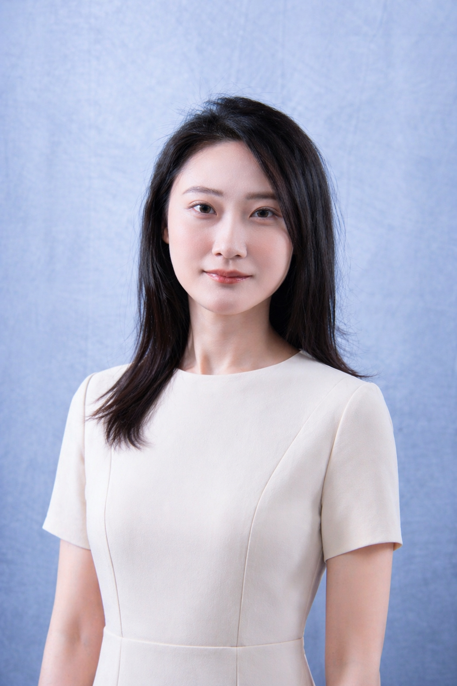

::: columns
::: {.column width="50%" style="text-align: center;"}

```{r, echo=FALSE, fig.align='center', out.width='60%'}

```

### Yining (Carina) Fu

:::

::: {.column width="50%" style="text-align: left;"}

Yining Fu is a statistics and biostatistics professional with academic training from North Carolina State University and Emory University. She holds a bachelor’s degree in Statistics with a minor in Economics and completed her graduate studies in Biostatistics at Emory University. Her background combines strong quantitative training with practical experience in data analysis, statistical modeling, and research.

Her technical skills include **Python, R, SAS, SQL, and Java**, with experience in data cleaning, hypothesis testing, regression analysis, machine learning, and A/B testing. She is also proficient in **Excel, PowerPoint, and Tableau** for data analysis, visualization, and communication.

Yining is especially interested in using data to support decision-making and turn complex results into clear, actionable insights. She brings a detail-oriented and analytical approach to problem solving, with the ability to work across both research and applied business contexts. Outside of work, she enjoys singing and baking.

:::